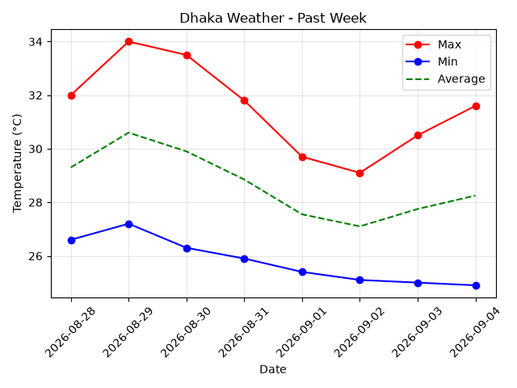
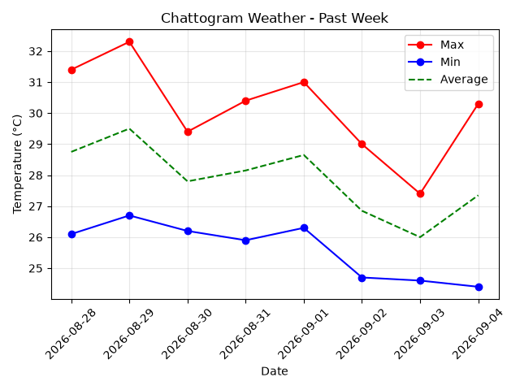
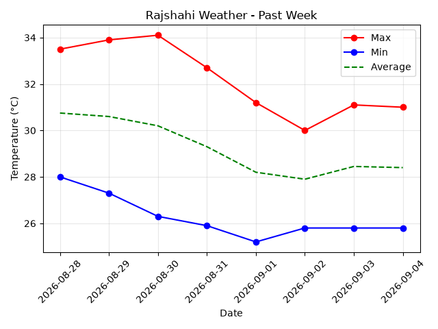
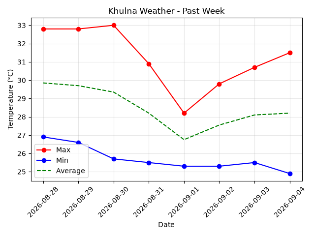
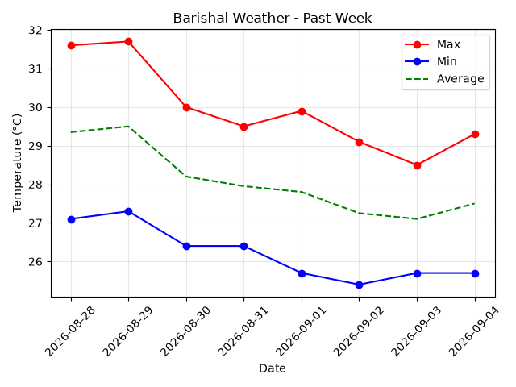
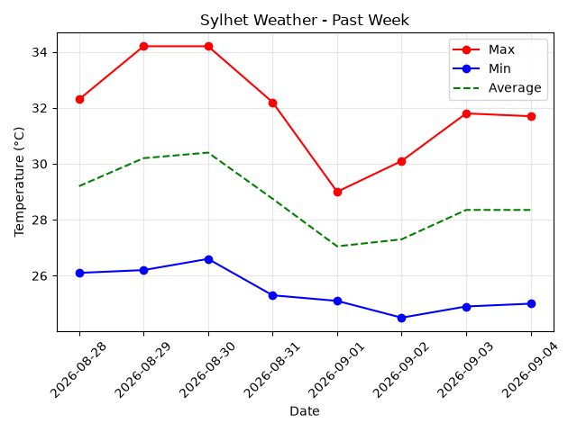
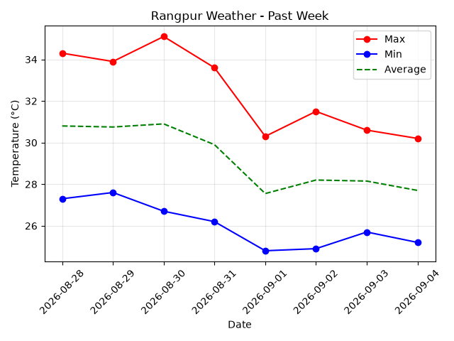
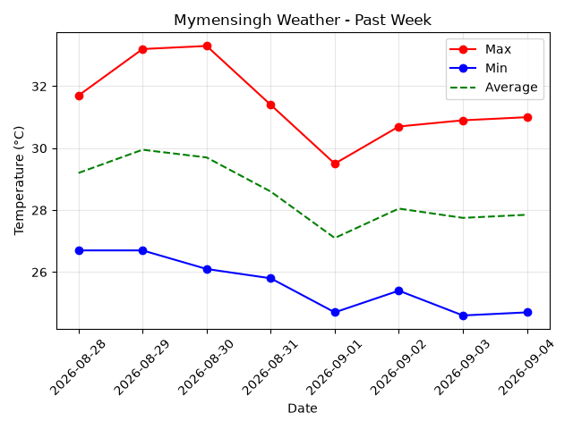

# Weather Data Visualization — Bangladesh

A Python practice project that fetches and visualizes the **last 7 days of weather data** for the **8 divisional cities of Bangladesh**.

The project uses the **Open-Meteo API** to retrieve daily maximum and minimum temperatures, processes the data with **Pandas**, and generates temperature charts using **Matplotlib**. The processed data and charts are automatically saved in an `output` folder.

## Features

* Fetches the last 7 days of weather data.
* Covers all 8 divisional cities of Bangladesh:

  * Dhaka
  * Chattogram
  * Rajshahi
  * Khulna
  * Barishal
  * Sylhet
  * Rangpur
  * Mymensingh
* Retrieves:

  * Daily maximum temperature
  * Daily minimum temperature
* Calculates daily average temperature.
* Generates weather visualization charts.
* Saves charts as `.png` files.
* Saves processed weather data as `.csv` files.
* Automatically creates the `output` directory.

## Technologies Used

* **Python**
* **Requests** — API requests
* **Pandas** — data processing
* **Matplotlib** — data visualization
* **Open-Meteo API** — weather data
* **Datetime** — date calculations
* **OS** — directory and file management

## Project Structure

```text
Weather-Data-Visualization/
│
├── main.py
├── requirements.txt
├── README.md
│
└── output/
    ├── Dhaka_chart.png
    ├── Dhaka_weather.csv
    ├── Chattogram_chart.png
    ├── Chattogram_weather.csv
    ├── Rajshahi_chart.png
    ├── Rajshahi_weather.csv
    ├── Khulna_chart.png
    ├── Khulna_weather.csv
    ├── Barishal_chart.png
    ├── Barishal_weather.csv
    ├── Sylhet_chart.png
    ├── Sylhet_weather.csv
    ├── Rangpur_chart.png
    ├── Rangpur_weather.csv
    ├── Mymensingh_chart.png
    └── Mymensingh_weather.csv
```

## Installation

### 1. Clone the repository

```bash
git clone https://github.com/luminary39/Weather-Data-Visualization.git
```

### 2. Navigate to the project

```bash
cd Weather-Data-Visualization
```

### 3. Create a virtual environment

```bash
python -m venv .venv
```

### 4. Activate the virtual environment

**Windows:**

```bash
.venv\Scripts\activate
```

**Linux/macOS:**

```bash
source .venv/bin/activate
```

### 5. Install dependencies

```bash
pip install -r requirements.txt
```

## Usage

Run the main Python file:

```bash
python main.py
```

The program will:

1. Calculate the date range for the previous 7 days.
2. Loop through all 8 divisional cities.
3. Send each city's coordinates to the Open-Meteo API.
4. Retrieve daily weather data.
5. Process the data using Pandas.
6. Calculate average temperature.
7. Generate a temperature chart.
8. Save the chart as a PNG file.
9. Save the processed data as a CSV file.

The generated files will be stored inside:

```text
output/
```

## Example Visualization

Each city receives a chart containing:

* Maximum temperature
* Minimum temperature
* Average temperature

### Sample Chart (Dhaka)

[](image_samples/Dhaka_chart.png)

<details>
<summary><b>Click to view sample charts for all 8 divisions</b></summary>
<br>

| Dhaka | Chattogram |
| :---: | :---: |
| [](image_samples/Dhaka_chart.png) | [](image_samples/Chattogram_chart.png) |

| Rajshahi | Khulna |
| :---: | :---: |
| [](image_samples/Rajshahi_chart.png) | [](image_samples/Khulna_chart.png) |

| Barishal | Sylhet |
| :---: | :---: |
| [](image_samples/Barishal_chart.png) | [](image_samples/Sylhet_chart.png) |

| Rangpur | Mymensingh |
| :---: | :---: |
| [](image_samples/Rangpur_chart.png) | [](image_samples/Mymensingh_chart.png) |

</details>

## Data Source

Weather data is provided by **Open-Meteo**.

API documentation:

https://open-meteo.com/

The project uses the Open-Meteo forecast endpoint with daily maximum and minimum temperature data.

## Learning Objectives

This project was created as a Python practice project to strengthen understanding of:

* Python functions
* Dictionaries and tuples
* Loops
* Tuple unpacking
* API requests
* JSON data
* Date and time handling
* Pandas DataFrames
* Data processing
* Matplotlib visualization
* File handling
* CSV generation
* Git and GitHub

## Future Improvements

Possible improvements for future versions:

* Add more weather variables such as precipitation, humidity, and wind speed.
* Add weather-condition indicators.
* Create a combined comparison chart for all 8 cities.
* Build an interactive dashboard.
* Add error handling for API failures.
* Store all city data in a single CSV file.
* Add automated data updates.
* Improve chart styling and presentation.
* Add command-line options for selecting cities and date ranges.

## Project Status

**Work in Progress**

This is a learning and practice project, and additional features may be added as I continue learning Python, APIs, data processing, and visualization.

## Author

**Sadman Sakib**

GitHub: https://github.com/luminary39
